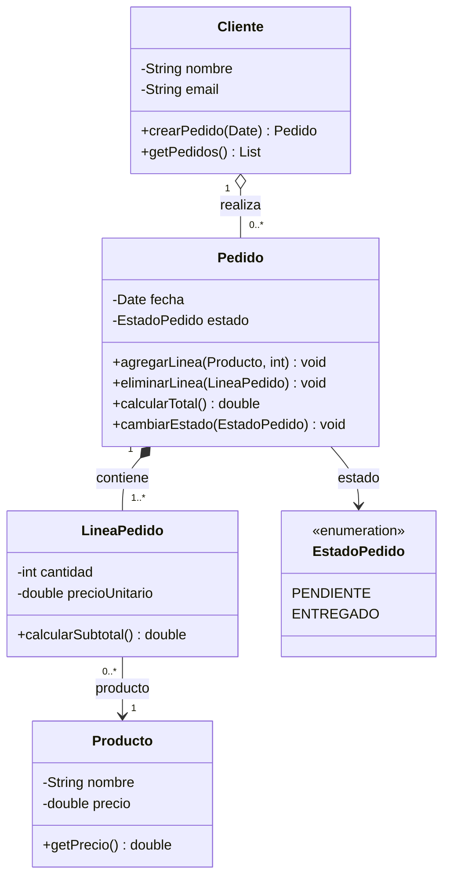

```mermaid
classDiagram
    class Cliente {
        -String nombre
        -String email
        +crearPedido(Date) Pedido
        +getPedidos() List
    }
    
    class Pedido {
        -Date fecha
        -EstadoPedido estado
        +agregarLinea(Producto, int) void
        +eliminarLinea(LineaPedido) void
        +calcularTotal() double
        +cambiarEstado(EstadoPedido) void
    }
    
    class LineaPedido {
        -int cantidad
        -double precioUnitario
        +calcularSubtotal() double
    }
    
    class Producto {
        -String nombre
        -double precio
        +getPrecio() double
    }
    
    class EstadoPedido {
        <<enumeration>>
        PENDIENTE
        ENTREGADO
    }
    
    Cliente "1" o-- "0..*" Pedido : realiza
    Pedido "1" *-- "1..*" LineaPedido : contiene
    LineaPedido "0..*" --> "1" Producto : producto
    Pedido --> EstadoPedido : estado
```
